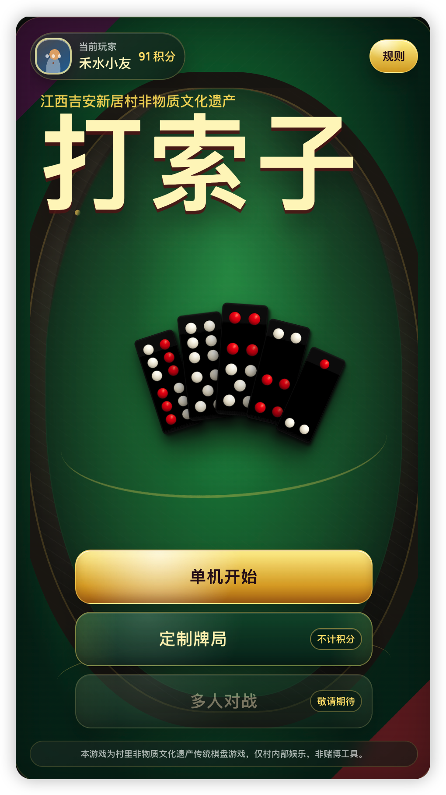
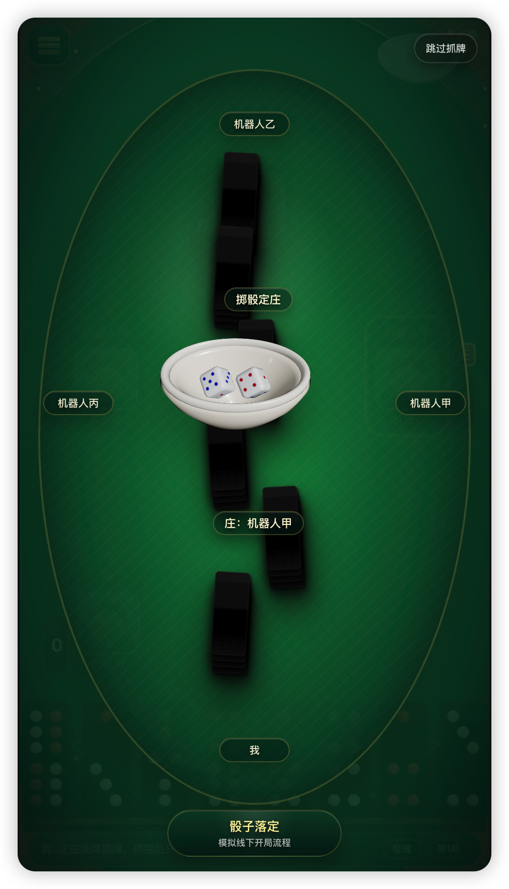
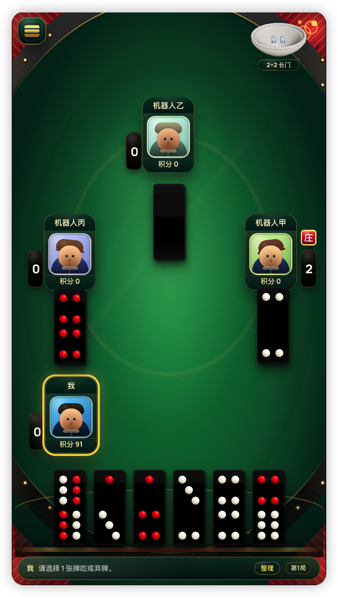
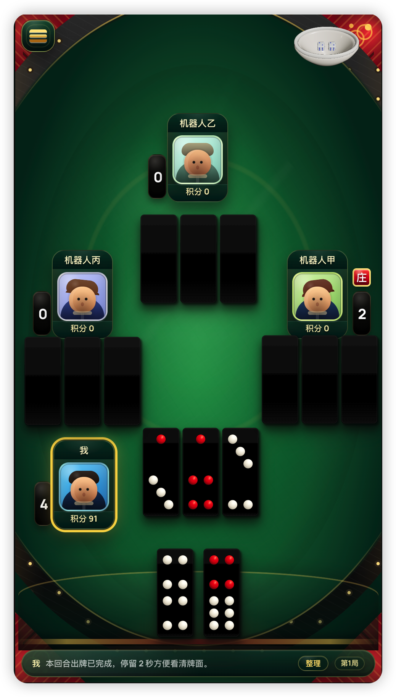
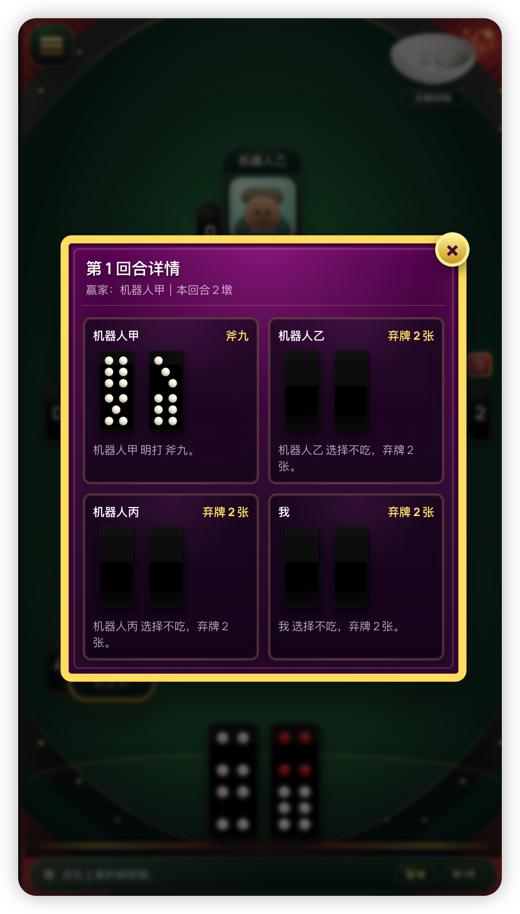
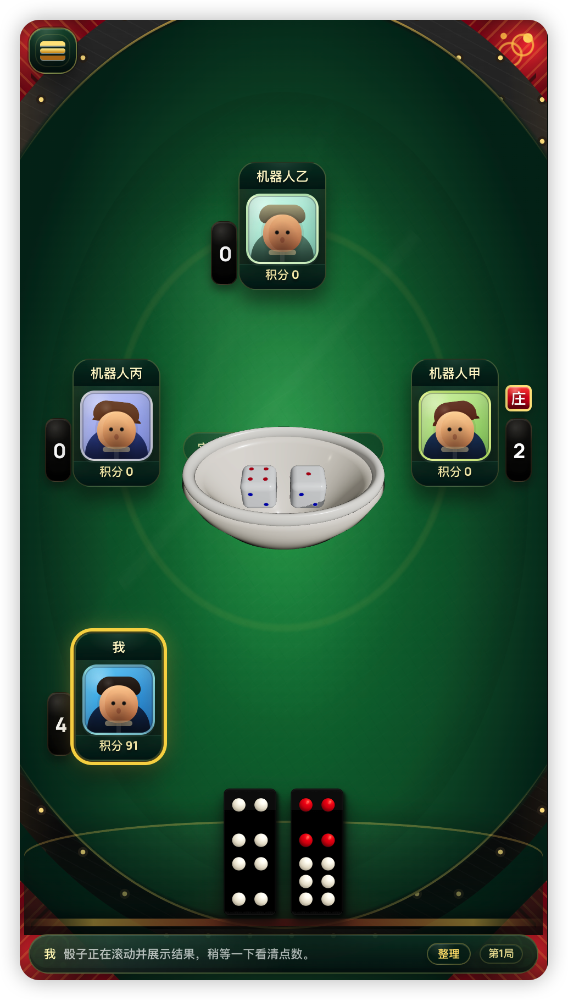
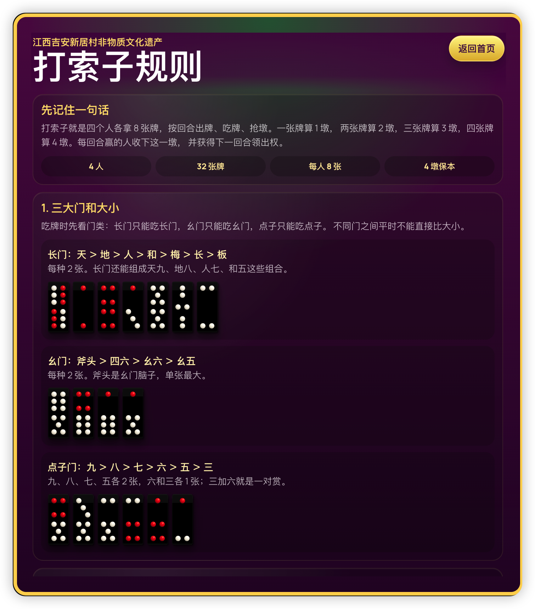
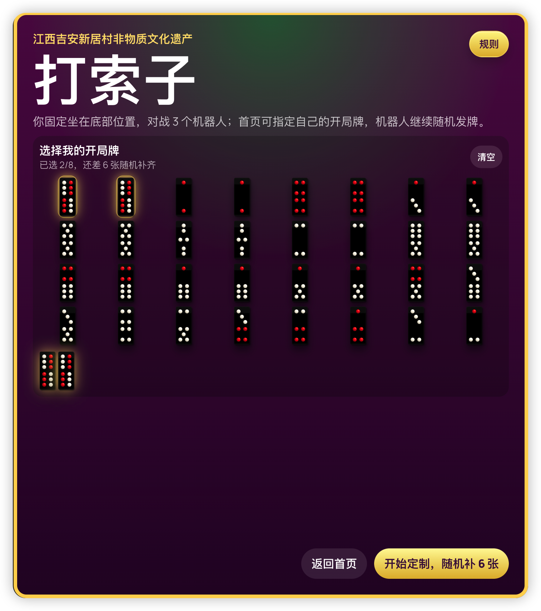

# 打索子

江西吉安新居村地方传统玩法数字化项目。

本项目记录和还原江西省吉安市富滩镇新居村流传的传统民俗牌九棋盘游戏“打索子”。它不是商业化对战平台，也不是赌博工具，而是为了把村里的老玩法、老口语、老规矩用现代 Web 技术保存下来，让年轻人也能在手机上学习、体验和继续传承。

## 为什么做这个项目

打索子曾经是村里人围坐在一起消遣、交流和记住乡土关系的一种方式，但现在年轻人会玩、愿意玩的人已经越来越少。很多规则并没有完整写在纸上，而是靠长辈口传、靠一局一局打出来的经验来记住。如果没有人继续整理和记录，再过几十年，一些细节口径、地方叫法和判断习惯可能就会慢慢消失。

做这个开源项目，是想把新居村这套玩法用代码、文档、测试和界面保存下来。哪怕以后真正坐在一起打的人少了，后人仍然可以通过这个项目看到牌长什么样、规则怎么走、为什么要这样结算，也可以继续修正、补充和传承。开源不是为了把它做成商业产品，而是希望这份村里的传统文化能被更长久地留下来。

## 在线体验

在线测试地址：[https://game9.qdkl.cn/](https://game9.qdkl.cn/)

## 界面预览

| 首页 | 开局掷骰定庄 | 牌桌对局 | 回合停留 |
| --- | --- | --- | --- |
|  |  |  |  |

| 回合详情 | 3D 骰碗 | 规则页面 | 定制牌局 |
| --- | --- | --- | --- |
|  |  |  |  |

## 项目定位

打索子是一种四人参与的传统牌九棋盘游戏，也可以理解为新居村本地口传规则下的骨牌类民俗玩法。每局 32 张牌，四家各 8 张，按回合明打、吃牌、弃牌、掷骰定门、抢墩和结算。玩法里包含“脑子”“赏”“无门弃牌”“活赏”“死赏”“墩数接法”等规则术语和玩法细节，很多判断依赖老一辈玩家口传经验。

这个项目的目标是：

- 把新居村打索子的规则整理成可阅读、可测试、可运行的数字版本。
- 在移动端提供接近线下牌桌的操作体验，方便村里人随时练习。
- 通过自绘牌面、骰碗动画、抓牌动画和赢墩复盘，还原传统桌面氛围。
- 保留规则引擎扩展能力，后续可以继续补充不同村庄或不同口径的玩法。

## 当前功能

- 单机对战：一个真人玩家对三个机器人。
- 定制牌局：玩家可以在首页指定自己的起手牌，方便验证规则和奖励分。
- 本地用户：浏览器本地保存用户、头像、积分流水和最近战绩。
- 积分保护：正常结算才记录输赢；只有玩家中途确认返回首页或重新开始时，才扣系统防刷牌分。
- 自绘牌面：32 张牌全部由代码绘制，不依赖整张牌图片切图。
- 3D 骰碗：右上角常驻骰碗，掷骰时移动到桌面中央播放 3D 动画。
- 洗牌抓牌：开局和下一局有洗牌、垒牌、抓牌的桌面仪式动画。
- 声音设置：音效和人物喊声可以独立开关、调节音量，也可以选择跳过开局抓牌动画。
- 口语喊牌：四个座位使用不同声线喊“出牌、吃、活赏、死赏”，结算时按最后赢家墩数喊传统“几接几”口诀。
- 回合复盘：点击赢墩数量或回合记录可以查看每一回合出的牌。
- 规则页面：首页内置详细规则说明，并使用游戏内真实自绘牌做示例。
- 局内帮助：牌桌底部和菜单都可查看规则与当前操作说明；不计积分的定制局提供合法牌组示例，选择后仍需自行确认出牌。
- 保存与重连保护：积分保存失败保留结算页并允许重试；联机检测心跳超时，恢复身份和牌局快照前暂停出牌，断网期间不补发旧动作。
- 机器人策略：入门档会出现合法但常见的新人失误；标准档使用稳健启发式；专家档会按公开信息随机模拟未知牌分布。三档都不读取真实对手手牌或背面弃牌。

## 技术栈

- React 19
- TypeScript
- Vite
- React Three Fiber / Drei / Three.js
- Framer Motion
- Vitest
- Oxlint
- IndexedDB 本地数据层

## 本地运行

安装依赖：

```bash
pnpm install
```

启动开发环境：

```bash
pnpm dev
```

默认访问：

```text
http://127.0.0.1:5173/
```

项目的 dev 命令已经使用 `--host 0.0.0.0`，同一局域网手机可通过电脑 IP 访问，例如：

```text
http://192.168.x.x:5173/
```

## 常用命令

```bash
pnpm lint
pnpm test -- --run
pnpm build
pnpm audit:bots
pnpm audit:difficulties
```

命令说明：

- `pnpm lint`：运行 Oxlint。
- `pnpm test -- --run`：运行规则和交互相关单测。
- `pnpm build`：执行 TypeScript 编译并构建生产包。
- `pnpm audit:bots`：批量跑机器人对局，检查机器人动作是否合法、对局是否能稳定结束。
- `pnpm audit:difficulties`：在相同公开局面横向比较三档机器人，检查动作差异是否达到可感知标准。

## 项目结构

```text
src/
  app/                         # 前端牌局控制器
  local-data/                  # 本地用户、积分流水、战绩和设置
  rules-core/                  # 通用规则类型和基础工具
  rules-variants/
    ji-an-da-suo-zi/           # 新居村打索子规则实现
  services/
    mock-match-api/            # 当前纯前端 mock 服务边界
  ui/
    components/                # 牌桌、首页、规则页、弹窗和 3D 骰碗
    audio/                     # 游戏音效入口
scripts/                       # 机器人审计脚本
public/sounds/                 # 可替换音效素材
assets/app-icon/               # 应用图标 SVG 源文件和 1024 像素母图
打索子规则.md                   # 当前已整理的规则文档
```

## 规则说明

规则文档见：

```text
打索子规则.md
```

规则引擎和 UI 都以内部稳定 ID 判断牌，不依赖中文别名。中文牌名主要用于展示和说明，避免不同人口语叫法影响程序逻辑。

## 文化说明

本项目仅用于江西省吉安市富滩镇新居村传统文化记录、规则学习和村内部娱乐体验。项目不提供真钱充值、提现、抽成、线上赌场或任何赌博相关功能。若后续打包成 Android / iOS 单机应用，也应继续保持这一定位。

## 开源协议

本项目使用 [MIT License](./LICENSE) 开源。

## Android App 构建

Android 原生容器使用 Capacitor，应用名称为“打索子”，包名为 `com.junegod.dasuozi`，并固定为竖屏显示。原生工程位于 `android/`，可以直接使用 Android Studio 打开。

应用图标源文件位于 `assets/app-icon/`。图标中的天牌和九点牌严格复用游戏内牌体比例、红白孔位、颜色和凹陷效果；Android 各密度图标已经写入对应的 `mipmap-*` 目录，Web 页签也使用同一套图标。

构建环境需要 Node.js 22 或更高版本、JDK 21、Android Studio，以及 Android SDK Platform 36。首次使用前先安装前端依赖：

```bash
pnpm install
```

构建 Web 资源并同步到 Android 工程：

```bash
pnpm android:sync
```

使用 Android Studio 打开原生工程：

```bash
pnpm android:open
```

通过 Capacitor 执行完整 Android 构建：

```bash
pnpm android:build
```

`android:build` 会先执行现有 Vite 生产构建，再同步 `dist/` 并调用 Android 原生构建。仓库不保存签名密钥；如需发布签名包，应在本机 Android Studio 或 CI 的安全凭据中配置密钥。

推送 `v*` 版本标签后，GitHub Actions 会自动执行代码检查、单元测试、三档机器人审计和 Android 构建，并把可直接安装的调试 APK 发布到对应 GitHub Release。调试 APK 适合当前单机版测试；正式上架应用商店前仍需配置长期保存的正式签名密钥。

## iOS App 构建与上架准备

iOS 原生工程位于 `ios/App/App.xcodeproj`，沿用应用名“打索子”和包名 `com.junegod.dasuozi`，支持 iOS 15.4+ 的 iPhone 竖屏。先安装 Xcode 26+ 及对应的 iOS 平台组件，再执行：

```bash
pnpm ios:sync
pnpm ios:open
pnpm ios:build
pnpm ios:archive
```

`ios:build` 生成模拟器包，`ios:archive` 生成未签名设备归档；它们都不能作为已签名 IPA 直接上架。开发者账户、发行地区资质、隐私政策正式托管、联机公开内容治理与真机验收仍需完成。完整步骤、当前机器构建限制和商店资料草稿见 [iOS 上架准备说明](docs/ios/APP_STORE.md)。

游戏内“设置 → 隐私与积分说明”可离线查看数据用途。单机不主动连接联机服务；首次选择联机时明确征求同意，已同意且未退出的房间可自动恢复。可通过设置撤回联机同意并退出房间。规则文案统一为“奖励分”“无门弃牌”和“先手”，积分无货币价值，不可购买、转让或兑换。
